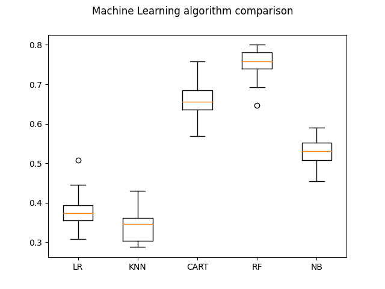

# ЛР№ 3

```text
 ── sources
    ├── output <-- .h5 файлы
    ├── result <-- диаграмка с моделями и классифицированые покемончики
    ├── test   <-- покемоны которых нужно классифицировать
    └── train  <-- обучающая выборка
```

### Вывод статистики по моделям
```text
              precision    recall  f1-score   support

           0       0.38      0.36      0.37        58
           1       0.00      0.00      0.00         6
           2       0.34      0.64      0.44        58
           3       0.00      0.00      0.00        17
           4       0.00      0.00      0.00        12
           5       0.00      0.00      0.00        13

    accuracy                           0.35       164
   macro avg       0.12      0.17      0.14       164
weighted avg       0.26      0.35      0.29       164

LR: 0.3838228438228438
              precision    recall  f1-score   support

           0       0.35      0.62      0.45        58
           1       0.00      0.00      0.00         6
           2       0.42      0.36      0.39        58
           3       0.00      0.00      0.00        17
           4       0.00      0.00      0.00        12
           5       0.00      0.00      0.00        13

    accuracy                           0.35       164
   macro avg       0.13      0.16      0.14       164
weighted avg       0.27      0.35      0.30       164

KNN: 0.34258741258741265
              precision    recall  f1-score   support

           0       0.80      0.83      0.81        58
           1       0.17      0.33      0.22         6
           2       0.83      0.84      0.84        58
           3       0.60      0.35      0.44        17
           4       0.20      0.17      0.18        12
           5       0.62      0.62      0.62        13

    accuracy                           0.70       164
   macro avg       0.54      0.52      0.52       164
weighted avg       0.71      0.70      0.70       164

CART: 0.6635664335664335
              precision    recall  f1-score   support

           0       0.82      0.95      0.88        58
           1       0.25      0.17      0.20         6
           2       0.75      0.95      0.84        58
           3       0.67      0.12      0.20        17
           4       0.25      0.08      0.12        12
           5       0.54      0.54      0.54        13

    accuracy                           0.74       164
   macro avg       0.55      0.47      0.46       164
weighted avg       0.70      0.74      0.69       164

RF: 0.7476223776223776
              precision    recall  f1-score   support

           0       0.69      0.50      0.58        58
           1       0.09      0.17      0.12         6
           2       0.59      0.88      0.71        58
           3       0.20      0.06      0.09        17
           4       0.00      0.00      0.00        12
           5       0.15      0.23      0.18        13

    accuracy                           0.52       164
   macro avg       0.29      0.31      0.28       164
weighted avg       0.49      0.52      0.48       164

NB: 0.523006993006993

```


### Сравнение алгоритмов

RF - крутой, выбираем его
