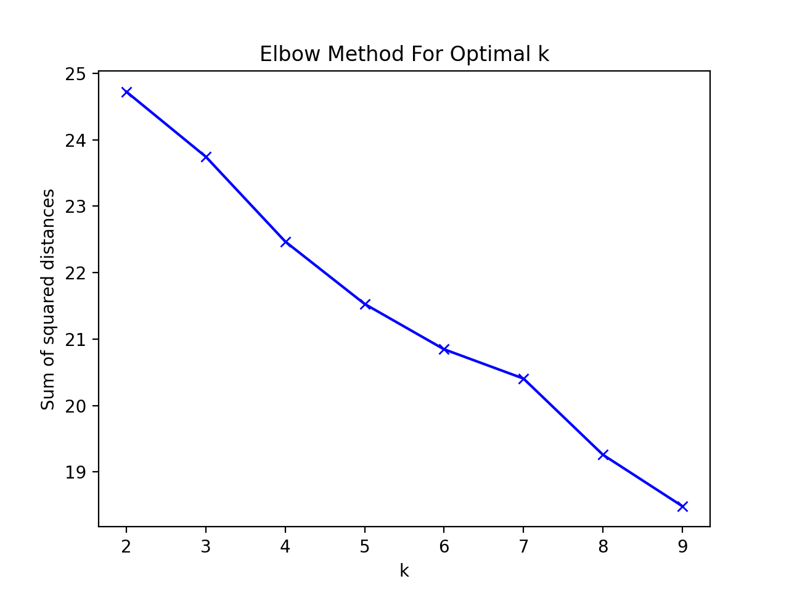
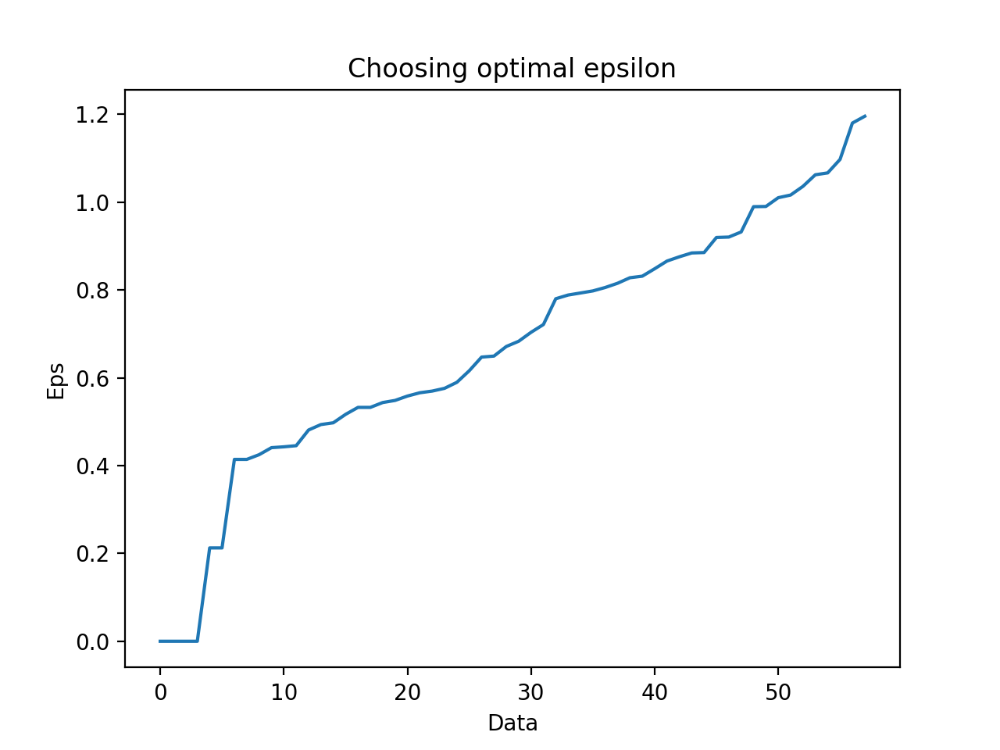
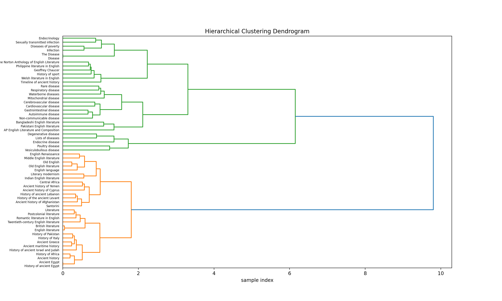

# OIRS

Лабораторная № 4.

Проект состоит из двух модулей и файла main.py:
    
1. extraction.py – выделение фичей и локально сохраняем в файл (чтобы каждый раз не пересчитывать при разработке)
2. clustering.py – elbow-метод, расчёт эпсилон для DBSCAN и, разумеется, несколько вариантов кластеризации

График elbow-метода: 



Починить DBSCAN так и не получилось, хотя пытался подбирать разные эпсилон. При «оптимальных» эпсилон (выбирал по соответствующему графику) шума становится чуть меньше, но кластеризация всё равно не работает, как надо.

График для подбора eps:



Дендограмма иерархической кластеризации: 



Аутпут кластеризации в консоль при k=3. Как показал эксперимент, лучше всего с задачей справляется обычный KMeans (особенно если задать число реальных кластеров):

```
                   KMeans                  
+--------------------------------------------+---+
| Endocrine disease                          | 0 |
| Degenerative disease                       | 0 |
| Lists of diseases                          | 0 |
| Poultry disease                            | 0 |
| Vesiculobullous disease                    | 0 |
| Ancient history                            | 1 |
| Postcolonial literature                    | 1 |
| Pakistani English literature               | 1 |
| Philippine literature in English           | 1 |
| Twentieth-century English literature       | 1 |
| Literature                                 | 1 |
| Literary modernism                         | 1 |
| The Norton Anthology of English Literature | 1 |
| Welsh literature in English                | 1 |
| Middle English literature                  | 1 |
| British literature                         | 1 |
| English language                           | 1 |
| Old English                                | 1 |
| Geoffrey Chaucer                           | 1 |
| Romantic literature in English             | 1 |
| English Renaissance                        | 1 |
| Indian English literature                  | 1 |
| History of ancient Israel and Judah        | 1 |
| History of ancient Egypt                   | 1 |
| Old English literature                     | 1 |
| History of the ancient Levant              | 1 |
| Ancient history of Afghanistan             | 1 |
| Timeline of ancient history                | 1 |
| Ancient history of Yemen                   | 1 |
| Ancient Egypt                              | 1 |
| History of ancient Lebanon                 | 1 |
| Ancient history of Cyprus                  | 1 |
| History of Africa                          | 1 |
| History of Italy                           | 1 |
| Central Africa                             | 1 |
| History of Pakistan                        | 1 |
| History of sport                           | 1 |
| Santorini                                  | 1 |
| English literature                         | 1 |
| Ancient Greece                             | 1 |
| Ancient maritime history                   | 1 |
| The Disease                                | 2 |
| Endocrinology                              | 2 |
| Mitochondrial disease                      | 2 |
| Rare disease                               | 2 |
| Waterborne diseases                        | 2 |
| Sexually transmitted infection             | 2 |
| Cardiovascular disease                     | 2 |
| Diseases of poverty                        | 2 |
| Infection                                  | 2 |
| Autoimmune disease                         | 2 |
| Respiratory disease                        | 2 |
| Disease                                    | 2 |
| AP English Literature and Composition      | 2 |
| Bangladeshi English literature             | 2 |
| Non-communicable disease                   | 2 |
| Gastrointestinal disease                   | 2 |
| Cerebrovascular disease                    | 2 |
+--------------------------------------------+---+
              MiniBatchKMeans               
+--------------------------------------------+---+
| Ancient history                            | 0 |
| Romantic literature in English             | 0 |
| Middle English literature                  | 0 |
| Pakistani English literature               | 0 |
| Philippine literature in English           | 0 |
| Twentieth-century English literature       | 0 |
| Literature                                 | 0 |
| Literary modernism                         | 0 |
| Bangladeshi English literature             | 0 |
| Welsh literature in English                | 0 |
| The Norton Anthology of English Literature | 0 |
| British literature                         | 0 |
| AP English Literature and Composition      | 0 |
| English language                           | 0 |
| Old English                                | 0 |
| Endocrinology                              | 0 |
| Old English literature                     | 0 |
| Indian English literature                  | 0 |
| English Renaissance                        | 0 |
| Santorini                                  | 0 |
| English literature                         | 0 |
| History of ancient Egypt                   | 0 |
| Ancient maritime history                   | 0 |
| Ancient Egypt                              | 0 |
| History of ancient Israel and Judah        | 0 |
| History of the ancient Levant              | 0 |
| Ancient history of Yemen                   | 0 |
| Ancient history of Cyprus                  | 0 |
| Ancient history of Afghanistan             | 0 |
| History of ancient Lebanon                 | 0 |
| History of sport                           | 0 |
| Central Africa                             | 0 |
| Timeline of ancient history                | 0 |
| History of Italy                           | 0 |
| History of Pakistan                        | 0 |
| Ancient Greece                             | 0 |
| History of Africa                          | 0 |
| Rare disease                               | 1 |
| Geoffrey Chaucer                           | 2 |
| Sexually transmitted infection             | 3 |
| The Disease                                | 3 |
| Endocrine disease                          | 3 |
| Mitochondrial disease                      | 3 |
| Degenerative disease                       | 3 |
| Waterborne diseases                        | 3 |
| Gastrointestinal disease                   | 3 |
| Disease                                    | 3 |
| Poultry disease                            | 3 |
| Vesiculobullous disease                    | 3 |
| Diseases of poverty                        | 3 |
| Infection                                  | 3 |
| Autoimmune disease                         | 3 |
| Respiratory disease                        | 3 |
| Cardiovascular disease                     | 3 |
| Non-communicable disease                   | 3 |
| Lists of diseases                          | 3 |
| Cerebrovascular disease                    | 3 |
| Postcolonial literature                    | 4 |
+--------------------------------------------+---+
                  DBSCAN                  
+--------------------------------------------+----+
| Cerebrovascular disease                    | -1 |
| Geoffrey Chaucer                           | -1 |
| Bangladeshi English literature             | -1 |
| Non-communicable disease                   | -1 |
| AP English Literature and Composition      | -1 |
| Philippine literature in English           | -1 |
| Pakistani English literature               | -1 |
| Disease                                    | -1 |
| Cardiovascular disease                     | -1 |
| Respiratory disease                        | -1 |
| Autoimmune disease                         | -1 |
| Infection                                  | -1 |
| Diseases of poverty                        | -1 |
| Welsh literature in English                | -1 |
| Vesiculobullous disease                    | -1 |
| History of sport                           | -1 |
| Lists of diseases                          | -1 |
| Timeline of ancient history                | -1 |
| Endocrinology                              | -1 |
| The Disease                                | -1 |
| Endocrine disease                          | -1 |
| Mitochondrial disease                      | -1 |
| Poultry disease                            | -1 |
| Rare disease                               | -1 |
| Degenerative disease                       | -1 |
| Ancient history of Yemen                   | -1 |
| Ancient history of Cyprus                  | -1 |
| Waterborne diseases                        | -1 |
| Sexually transmitted infection             | -1 |
| Gastrointestinal disease                   | -1 |
| The Norton Anthology of English Literature | -1 |
| English language                           |  0 |
| British literature                         |  0 |
| Old English                                |  0 |
| Ancient history                            |  0 |
| Literature                                 |  0 |
| History of ancient Egypt                   |  0 |
| Ancient maritime history                   |  0 |
| Ancient Egypt                              |  0 |
| History of ancient Israel and Judah        |  0 |
| History of the ancient Levant              |  0 |
| Ancient history of Afghanistan             |  0 |
| History of ancient Lebanon                 |  0 |
| Ancient Greece                             |  0 |
| History of Africa                          |  0 |
| Literary modernism                         |  0 |
| History of Italy                           |  0 |
| History of Pakistan                        |  0 |
| Santorini                                  |  0 |
| English literature                         |  0 |
| Indian English literature                  |  0 |
| Old English literature                     |  0 |
| Romantic literature in English             |  0 |
| Middle English literature                  |  0 |
| Postcolonial literature                    |  0 |
| Twentieth-century English literature       |  0 |
| Central Africa                             |  0 |
| English Renaissance                        |  0 |
+--------------------------------------------+----+
```

